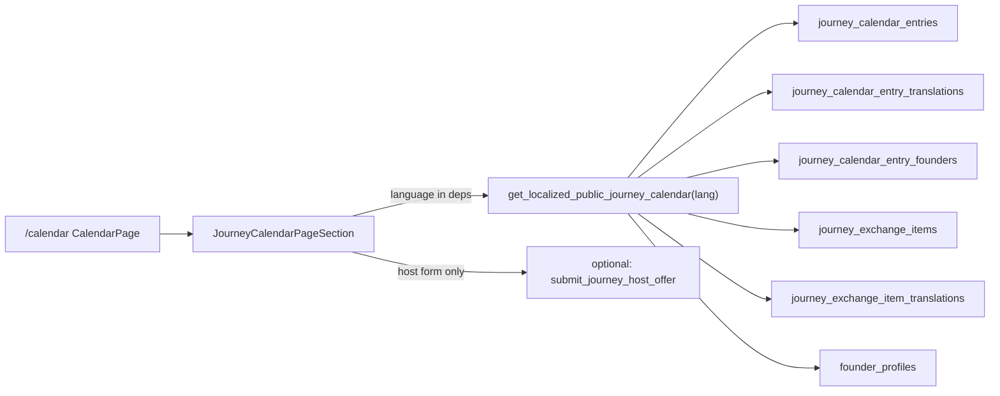

# Public Journey Calendar — Design Specification

Status: approved scope + data-path design (implementation plan follows separately)

Date: 2026-07-17

## 1. Confirmed product scope

### In scope (Tier 1 only)

The public calendar renders **future and current travel stops** from the existing journey calendar domain:

| Source | Role on calendar |
|---|---|
| `journey_calendar_entries` | Calendar events (date ranges, place, status, hosting) |
| `journey_calendar_entry_translations` | Localized title, place labels, summary, purpose, host message |
| `journey_calendar_entry_founders` + `founder_profiles` (public) | People on each stop |
| `journey_exchange_items` + translations | Needs/offers shown in the **selected-stop detail panel**, not as separate calendar axes |
| `journey_host_offers` | Write-only host intake only; **never** expose PII publicly |

Public read filters match the existing view `public_journey_calendar`:

- `is_public = true`
- `status <> 'cancelled'`
- Include statuses: `idea`, `planned`, `confirmed`, `travelling`, `completed` (completed may appear as past stops within the same calendar domain; they are still calendar entries, not journal history)

### Explicitly out of scope

| Tier | Sources | Reason |
|---|---|---|
| Tier 2 | `journal_journey_entries`, `journal_posts`, `founder_timeline_events`, `public_journal_map_points` | Past lived journey / map / founder biography — keep on journal map and founder timeline |
| Tier 3 | `platform_updates`, `founder_wins`, `founder_locations`, `offers`, `open_roles` | Different product surfaces (changelog, catalog, roles) |

Do **not** merge past journal pins or platform updates onto the calendar grid. Visitors must not confuse a host request with a published journal day.

### UI status mapping

Database statuses: `idea` | `planned` | `confirmed` | `travelling` | `completed` | `cancelled`.

Calendar UI badges:

| DB `status` | UI treatment |
|---|---|
| `travelling` | “Now” / current stop highlight (replace incorrect frontend check for `status === 'current'`) |
| `planned`, `confirmed` | Upcoming |
| `idea` | Tentative |
| `completed` | Past stop within calendar domain |
| `cancelled` | Excluded by query |

---

## 2. Architecture



### Chosen approach

**Single localized security-definer RPC** that returns the full public calendar payload for one language.

Rejected alternatives:

1. **Keep multi-query client joins** (as in `FounderSupportUpcomingTimeline`) — works but duplicates localization logic, risks incomplete translation status filters, and makes language switching fragile.
2. **Extend English-only `public_journey_calendar` view** — views cannot take `language_code`; would still need client-side translation joins.
3. **Unified past+future view** — rejected by confirmed scope.

---

## 3. Backend: `get_localized_public_journey_calendar`

### Signature

```sql
create or replace function public.get_localized_public_journey_calendar(
  p_language_code text default 'en'
)
returns jsonb
language plpgsql
stable
security definer
set search_path to 'public', 'pg_catalog', 'pg_temp'
```

### Authorization

- `GRANT EXECUTE` to `anon` and `authenticated`
- Same visibility rules as `public_journey_calendar`
- No host-offer rows or contact fields in the payload

### Language fallback

1. Normalize `p_language_code` (trim; default `en`).
2. For each translatable field, prefer a row for the requested language with `translation_status in ('machine','reviewed','published')` (same set as `FounderSupportUpcomingTimeline`).
3. Else fall back to an English translation row with the same status set.
4. Else fall back to the canonical English columns on the parent table row.
5. Set `active_language` to the language that actually supplied the primary text fields (`title` / `public_summary`).

### Payload shape (JSON array)

Each element:

```json
{
  "id": "uuid",
  "slug": "string",
  "journey_person": "kevin|micha|together",
  "status": "planned|travelling|...",
  "starts_on": "YYYY-MM-DD",
  "ends_on": "YYYY-MM-DD|null",
  "date_flexibility_days": 0,
  "country_code": "ES",
  "country_name": "…",
  "region_name": "…",
  "city_name": "…",
  "location_name": "…",
  "latitude": null,
  "longitude": null,
  "title": "localized",
  "public_summary": "localized|null",
  "purpose": "localized|null",
  "transport_mode": "…",
  "accommodation_needed": true,
  "accommodation_from": "YYYY-MM-DD|null",
  "accommodation_until": "YYYY-MM-DD|null",
  "guests_count": 2,
  "nights_needed": 3,
  "host_request_message": "localized|null",
  "host_request_status": "open",
  "can_offer_hosting": true,
  "is_featured": true,
  "display_order": 1,
  "related_journal_post_id": null,
  "related_journal_post_slug": null,
  "active_language": "es",
  "founders": [
    {
      "id": "uuid",
      "slug": "kevin-de-vlieger",
      "display_name": "Kevin",
      "avatar_url": "…",
      "profile_url": "/founders/…"
    }
  ],
  "needs": [
    {
      "id": "uuid",
      "slug": "…|null",
      "category": "sleeping_place",
      "title": "localized",
      "description": "localized|null",
      "priority": "normal",
      "display_order": 0
    }
  ],
  "offers": [ /* same shape as needs */ ]
}
```

`can_offer_hosting` logic must match `public_journey_calendar`:

- `accommodation_needed`
- `host_request_status in ('open','offers_received')`
- `status in ('planned','confirmed','travelling')`

### Ordering

`order by starts_on asc, display_order asc, created_at asc`

### Exchange item rules

Include only items where:

- `is_public = true` and `status = 'active'`
- `calendar_entry_id` equals the entry only — **omit unlinked global items** from the calendar payload so each stop’s detail stays stop-specific

Unlinked global needs/offers remain on journal exchange sections / offers routes, not forced into every calendar day.

### Empty result

Return `[]` (valid successful empty). The frontend must distinguish empty from error.

### Failure

Raise/propagate SQL errors; do not coerce failures to `[]`.

### Optional follow-up RPC (not required for v1)

`get_localized_public_journey_calendar_entry(p_slug text, p_language_code text)` for deep links `/calendar/:slug` — defer until deep-link UX is required. V1 uses in-page selection by `id`/`slug` from the list payload.

### Host offer write path (included in v1)

When the selected stop has `can_offer_hosting = true`, the detail panel shows a host offer form that inserts into `journey_host_offers` (private table). Rely on existing RLS that allows `anon` insert of new offers only and never select. Do not invent a public read of offers. If current RLS is insert-denied for anon, fix that in the same migration as the RPC — do not weaken select policies.

---

## 4. Frontend page and components

### Route

- Path: `/calendar`
- Shell: same public site shell as `/offers` (`Header` + `page-shell` + `Footer`) via [`src/main.tsx`](src/main.tsx)
- Register page in `website_pages` when that registry is updated for new public pages (same migration batch as UI keys if required by existing page registry workflow)

### Navigation

Add `navigation.calendar` to header nav (Explore group), with 30-language `website_translations` rows, registry link, and manifest coverage — no hardcoded “Calendar” label.

### Primary component

Evolve the embedded [`JourneyCalendarPlanner`](src/components/JourneyCalendarPlanner.tsx) into the page section component **`PublicJourneyCalendarSection`** (file may stay colocated or be renamed in the same change):

- Export `PUBLIC_JOURNEY_CALENDAR_SECTION_I18N_MANIFEST`
- Register in `website_ui_components` with component key `components.journey.calendar.page`
- Call `supabase.rpc('get_localized_public_journey_calendar', { p_language_code: language })`
- Include `language` in `useEffect` dependencies
- Distinct states: loading / error / empty / ready — all via `t()` keys
- Date formatting via `formatDate` from `useWebsiteI18n()` (no hard-coded `en` `Intl`)
- Treat `status === 'travelling'` as current (“Now”), not `current`
- Remove hardcoded English eyebrow/heading/body copy currently in `JourneyCalendarPlanner`

### Page composition (one job per section)

1. **Hero** — brand-consistent title + one supporting sentence (translation keys only); no stats strip.
2. **Calendar strip / range list** — selectable stops from RPC.
3. **Selected stop detail** — place, summary, founders, hosting CTA, needs, offers.
4. **Host form** — shown only when `can_offer_hosting` is true for the selected stop.

Reuse existing CSS patterns from `JourneyCalendarPlanner.css` where possible; do not invent a second visual system.

### Existing embeds

- `FounderSupportUpcomingTimeline` may keep its narrower “next planned stops” query for founder-support context, or later switch to the same RPC with client-side filter — **out of scope for calendar v1** beyond not breaking it.
- Journal landing map/timeline continues to use Tier 2 sources only.

---

## 5. i18n contract

### Static UI keys (namespace `journey_calendar`)

Reuse existing keys where present (`journey_calendar.loading|error|empty|now|current_location`) and add page-level keys as needed, for example:

- `journey_calendar.page.title`
- `journey_calendar.page.description`
- `journey_calendar.page.seo_title`
- `journey_calendar.page.seo_description`
- `journey_calendar.status.travelling` / `.planned` / `.confirmed` / `.idea` / `.completed`
- `journey_calendar.needs_heading` / `journey_calendar.offers_heading`
- `journey_calendar.host_cta` / host form labels
- `navigation.calendar`

Every new key: upsert `website_translation_keys` + **30 languages** in `website_translations` with migration bootstrap proof; link via `website_ui_component_translation_keys`.

### Dynamic content

Documented in manifest `entityContent`:

```ts
entityContent: {
  rpc: 'get_localized_public_journey_calendar',
  tables: [
    'journey_calendar_entries',
    'journey_calendar_entry_translations',
    'journey_calendar_entry_founders',
    'journey_exchange_items',
    'journey_exchange_item_translations',
  ],
}
```

### Surface registration

Add the calendar page/component to `scripts/public-i18n-surfaces.json` so `npm run verify:i18n` covers it.

---

## 6. Error, empty, and loading behavior

| State | Condition | UI |
|---|---|---|
| Loading | Request in flight | Translated loading copy; no fake zeros |
| Error | Non-OK response / parse failure | Translated error; no silent `[]` |
| Empty | RPC returns `[]` | Translated empty |
| Ready | One or more entries | Calendar + detail |

Never initialize placeholder calendar entries in production code.

---

## 7. Verification checklist (for implementation)

1. Query live `journey_calendar_entries` (expect 4 public rows today) and compare RPC output field-for-field.
2. Switch language (en, es, and one non-Latin / RTL if active) — titles/summaries/needs update without full page remount beyond existing i18n behavior.
3. Confirm cancelled rows never appear; host offer emails never appear in network payloads.
4. Confirm `travelling` stops show “Now”; planner no longer looks for `current`.
5. Run `npm run lint`, `typecheck`, `test`, `build`, `verify:i18n` (and `verify:i18n:live` when env available).

---

## 8. Definition of done for this design

- Scope locked to Tier 1 + stop-linked exchange detail.
- Localized RPC contract specified.
- `/calendar` page + i18n/registry obligations specified.
- Tier 2/3 excluded from the calendar grid.

Implementation work (migration, RPC, page, nav, i18n seed) starts only after this design is accepted and an implementation plan is written.
